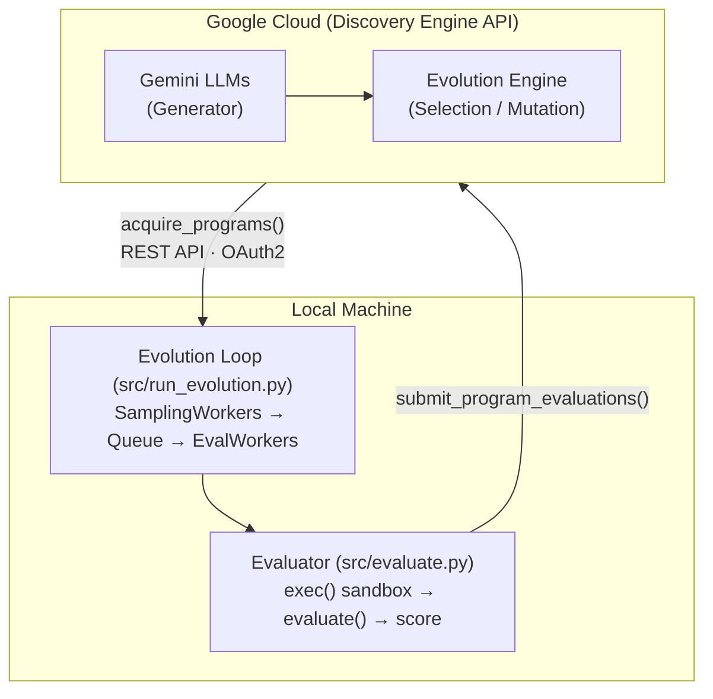

# Circle Packing — AlphaEvolve Example

Evolve a Python algorithm to pack N=26 circles into a unit square, maximizing
the sum of their radii. Uses local Python evaluation.

## Overview

- **Problem**: Pack 26 non-overlapping circles inside a unit square to maximize
  the total sum of their radii.
- **What gets evolved**: The `construct_packing()` and `compute_max_radii()`
  functions inside the EVOLVE-BLOCK in `src/program.py`.
- **Baseline**: A simple concentric ring layout (1 center + 8 inner + 16 outer)
  with proportional radius scaling.

## Architecture



## Metrics

| Metric | Description |
|--------|-------------|
| `sum_of_radii` | **Primary.** Sum of all circle radii. Higher is better. |

Constraint violations (overlap, out-of-bounds) return `-inf`.

## Prerequisites

1. Python >= 3.9
2. GCP project with Discovery Engine API enabled
3. `gcloud` CLI installed and authenticated

## Quick Start

### 1. Setup

```bash
make setup    # Install deps, create .env from template
make auth     # Authenticate with GCP
```

Edit `.env` with your `PROJECT_ID` and `GE_APP_ID`.

### 2. Run

```bash
make run      # Start the AlphaEvolve experiment
```

To enable parallel evaluation locally, set `PARALLEL_EVALUATION=True` in your `.env` file. You can also configure `WORKER_CONCURRENCY` to adjust the number of parallel threads used for evaluating candidates.

The experiment will:
1. Upload the seed packing algorithm from `src/program.py`.
2. Run the evolution loop, generating and evaluating new variations.
3. Visualize the top packings using `matplotlib`.

## Files

| Path | Purpose |
|------|---------|
| `instructions.md` | Problem description and instructions for the LLM |
| `Makefile` | Step-by-step orchestration (`make help` for targets) |
| `example.env` | Configuration template (copy to `.env`) |
| `src/program.py` | The packing algorithm being evolved (`EVOLVE-BLOCK` markers) |
| `src/evaluate.py` | Client-side evaluation function and visualization |
| `src/run_evolution.py` | Entry point: runs the evolution loop |
