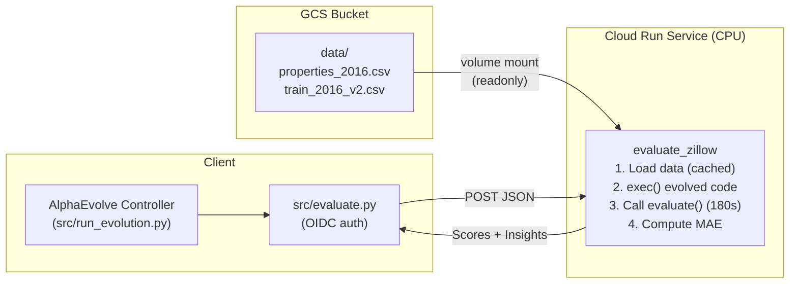

# Zillow Prize: Zestimate Logerror Prediction

Use AlphaEvolve to evolve an ML pipeline (algorithm + feature engineering +
hyperparameters) that predicts the log-error of Zillow's Zestimate home
valuation. Based on the
[Zillow Prize Kaggle competition](https://www.kaggle.com/competitions/zillow-prize-1).

## Problem

Predict `logerror = log(Zestimate) - log(SalePrice)` for ~2.9M properties in
Los Angeles, Orange, and Ventura counties using ~58 property features.
Evaluation metric: **Mean Absolute Error (MAE)**.

| Approach | Expected MAE |
|----------|-------------|
| Predict zero (naive) | ~0.0675 |
| Ridge regression (seed) | ~0.0660 |
| Tuned LightGBM | ~0.0652 |
| Ensemble + feature engineering | ~0.0645 |

## What Gets Evolved

The `EVOLVE-BLOCK` in `src/program.py` contains `build_and_predict(train_df,
train_target, val_df)` — a complete ML pipeline from raw features to
predictions. AlphaEvolve can explore:

- **Feature engineering**: ratios, interactions, geographic clustering, temporal
  features, deviation from zip-code medians
- **Model selection**: LightGBM, XGBoost, RandomForest, Ridge, ElasticNet
- **Hyperparameter tuning**: learning rate, tree depth, regularisation
- **Ensembling**: blending multiple models
- **Missing-value handling**: imputation strategies, indicator columns
- **Outlier treatment**: clipping extreme logerror values

## Architecture



The Zillow dataset is stored in a GCS bucket and mounted as a read-only
volume into the Cloud Run service. This keeps the Docker image small and
avoids re-downloading on every cold start.

## Prerequisites

- GCP project with billing enabled
- [Terraform](https://developer.hashicorp.com/terraform/install) >= 1.5
- `gcloud` CLI authenticated (`gcloud auth application-default login`)
- Kaggle account (free) for downloading competition data
- AlphaEvolve client library installed (`uv pip install -e ".[dev]"`)

## Quick Start

All steps are driven by the `Makefile`. Run `make help` to see available
targets.

### 1. Setup

```bash
cd examples/kaggle_competition
make setup    # Install deps, create .env from template
make auth     # Authenticate with GCP
```

Edit `.env` with your `PROJECT_ID` and `GE_APP_ID`.

### 2. Infrastructure

```bash
make infra    # Provision GCP resources with Terraform
```

This creates via Terraform:
- Required GCP APIs (Cloud Run, Artifact Registry, Cloud Build, Storage)
- Artifact Registry repository for Docker images
- GCS bucket for the Zillow dataset
- IAM permissions for Cloud Build and Cloud Run
- Discovery Engine engine and assistant

### 3. Download and Upload Kaggle Data

Download the competition data locally (this step is manual because it
requires Kaggle authentication). You must first
[join the Zillow Prize competition](https://www.kaggle.com/competitions/zillow-prize-1)
on Kaggle to accept the rules and gain access to the dataset.

```bash
# Set up Kaggle token (https://www.kaggle.com/settings → Generate New Token)
mkdir -p ~/.kaggle
echo -n "KGAT_your_token_here" > ~/.kaggle/access_token
chmod 600 ~/.kaggle/access_token

# Install kaggle CLI and download
uv pip install kaggle
kaggle competitions download -c zillow-prize-1 -p data/
unzip data/zillow-prize-1.zip -d data/
```

Then upload to the GCS bucket created by `make infra`:

```bash
make data     # Upload CSV files from data/ to GCS
```

### 4. Deploy

```bash
make deploy   # Build evaluator image and deploy to Cloud Run
```

This runs Cloud Build to:
1. Verify Zillow data exists in the GCS bucket
2. Build the Docker image (Python + ML libs, no data baked in)
3. Push to Artifact Registry
4. Deploy to Cloud Run with a GCS volume mount at `/mnt/artifacts`

After deployment, get the evaluator URL and update `.env`:

```bash
gcloud run services describe alphaevolve-kaggle-evaluator \
  --region=us-central1 \
  --format='value(status.url)'
```

Set `EVALUATOR_URL` in `.env` to the URL above.

### 5. Run

```bash
make run      # Start the AlphaEvolve experiment
```

The experiment will:
1. Upload the seed hyperparameter configuration (Ridge regression)
2. Start evolutionary search (50 candidates, 4 concurrent evaluations)
3. Each evaluation takes ~30-60 seconds on Cloud Run
4. Print a report with the best evolved configurations when complete

### 6. Clean up

```bash
make clean    # Tear down all GCP infrastructure
```

## File Structure

```
examples/kaggle_competition/
├── __init__.py                 # Package marker
├── src/
│   ├── __init__.py             # Src package marker
│   ├── program.py              # Seed program with EVOLVE-BLOCK
│   ├── evaluate.py             # Client-side: POST to Cloud Run
│   ├── run_evolution.py        # Entry point
│   └── utils/
│       ├── __init__.py
│       └── report.py           # Result visualization
├── deploy/
│   ├── Dockerfile              # Evaluator container (Python 3.11 + ML libs)
│   ├── main.py                 # Cloud Run evaluator service
│   └── requirements.txt        # Server dependencies
├── cloudbuild.yaml             # Build + deploy pipeline
├── Makefile                    # Orchestrates setup / infra / data / deploy / run / clean
├── terraform/
│   ├── main.tf                 # APIs, IAM, AR, GCS bucket, DE
│   ├── variables.tf            # Input variables
│   ├── outputs.tf              # Bucket name, registry URL, etc.
│   └── terraform.tfvars.example
├── example.env                 # Configuration template
├── README.md                   # This file
├── data.md                     # Competition dataset description
├── overview.md                 # Competition overview
└── data/                       # Local data (gitignored, for upload)
    ├── properties_2016.csv
    └── train_2016_v2.csv
```

## Evaluation Metrics

| Metric | Description |
|--------|-------------|
| `neg_mae` | Primary metric (higher = better). Negative of MAE. |

Failed evaluations return `neg_mae = None` with an insight message explaining
what went wrong (timeout, invalid predictions, runtime error, etc.). These
insights feed back into AlphaEvolve's LLM to guide the next generation.

## Cost Estimate

- **Cloud Run (CPU)**: ~$0.05/hour per instance (4 vCPU, 8 GiB)
- **Per evaluation**: ~$0.001-0.002 (30-60 seconds)
- **Full experiment (50 evals)**: ~$0.05-0.10 in Cloud Run costs
- **GCS storage**: ~$0.02/GB/month for dataset (~0.6 GB)
- **AlphaEvolve API**: Separate billing via Discovery Engine
