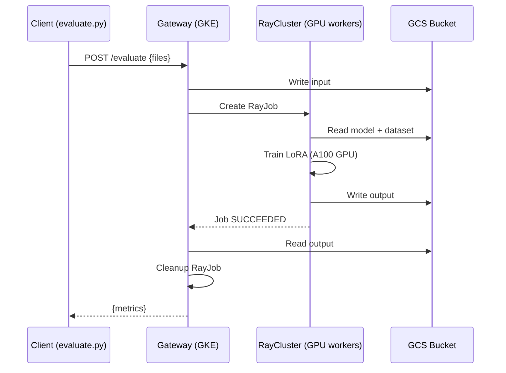

# LLM Fine-Tuning Hyperparameter Optimization

Use AlphaEvolve to evolve LoRA fine-tuning hyperparameters for
**Gemma 4 E2B** (2.3B effective / 5.1B with embeddings) on a **function-calling dataset**
([NousResearch/hermes-function-calling-v1](https://huggingface.co/datasets/NousResearch/hermes-function-calling-v1)).

AlphaEvolve generates and evaluates different hyperparameter configurations,
guided by evaluation loss on a held-out split. The evolutionary search discovers
configurations that outperform typical defaults.

## What Gets Evolved

The `get_training_config()` function in `src/program.py` returns a dict of
hyperparameters. AlphaEvolve evolves this function within the
`EVOLVE-BLOCK` markers:

| Parameter | Seed Value | Range | Impact |
|-----------|-----------|-------|--------|
| `lora_r` | 16 | 4-64 | LoRA rank (capacity vs efficiency) |
| `lora_alpha` | 32 | 8-128 | LoRA scaling factor |
| `lora_dropout` | 0.05 | 0.0-0.2 | Regularization on LoRA layers |
| `lora_target_modules` | `[q_proj, v_proj]` | subsets of 7 modules | Which layers get LoRA |
| `learning_rate` | 5e-5 | 1e-5 - 1e-3 | **Most impactful** single parameter |
| `lr_scheduler_type` | cosine | cosine, linear, constant_with_warmup | Decay schedule |
| `warmup_ratio` | 0.03 | 0.0-0.1 | Training stability |
| `weight_decay` | 0.01 | 0.0-0.1 | L2 regularization |
| `optim` | adamw_torch | adamw_torch, adamw_8bit, adafactor | Optimizer choice |
| `max_grad_norm` | 1.0 | 0.1-5.0 | Gradient clipping |
| `per_device_train_batch_size` | 2 | 1-8 | GPU memory constrained |
| `gradient_accumulation_steps` | 4 | 1-8 | Effective batch size |
| `max_seq_length` | 512 | 256-1024 | Sequence truncation |
| `bf16` | True | True/False | Mixed precision |

Training is fixed at **200 steps** with LoRA on a bf16 model using NVIDIA L4 GPU.

## Architecture



A persistent **RayCluster** runs on GKE with autoscaling L4 GPU workers.
A lightweight **gateway** receives HTTP requests and creates **RayJobs** on
the cluster. Multiple evaluations run in parallel (N workers = N concurrent
evals). The model and dataset are stored in GCS and mounted via GCS FUSE.

## Prerequisites

1. Python >= 3.9
2. GCP project with billing enabled
3. [Terraform](https://developer.hashicorp.com/terraform/install) >= 1.5
4. `gcloud` CLI installed and authenticated
5. NVIDIA L4 GPU quota in your GKE region
6. HuggingFace account with access to Gemma 4 (if model is gated)

## Quick Start

### 1. Setup

```bash
cd examples/llm_fine_tuning
make setup    # Install deps, create .env from template
make auth     # Authenticate with GCP
```

Edit `.env` with your `PROJECT_ID`, `GE_APP_ID`, and `HF_TOKEN`.

### 2. Infrastructure

```bash
make infra    # Provision GCP resources (GKE, RayCluster, monitoring)
```

This creates via Terraform:
- GKE Standard cluster with Ray Operator addon, Workload Identity, GCS FUSE CSI
- CPU node pool (1 node) for the gateway and Ray head
- GPU node pool (0-4 nodes, autoscaling) with NVIDIA L4 for Ray workers
- Persistent **RayCluster** (head + autoscaling GPU workers)
- Namespace, ServiceAccounts, RBAC, Workload Identity bindings
- Prometheus + Grafana monitoring (if `enable_monitoring = true`)
- PodMonitors for Ray head and worker metrics
- GCP service accounts, Artifact Registry, GCS bucket, Discovery Engine

### 3. Deploy

```bash
make deploy   # Build images, download model/dataset, deploy gateway
```

This runs Cloud Build to:
1. Download model and dataset to GCS (skips if cached)
2. Build the **training** image (CUDA + PyTorch) and push to Artifact Registry
3. Build the **gateway** image (Flask) and push to Artifact Registry
4. Deploy the **gateway** Deployment + Service

### 4. Verify

```bash
make ray-dashboard  # Open http://localhost:8265 to check cluster health
```

### 5. Run

```bash
make run      # Start the AlphaEvolve experiment
```

The experiment will:
1. Upload the seed hyperparameter configuration
2. Start evolutionary search (20 candidates, 4 concurrent evaluations)
3. Each evaluation takes ~5-10 minutes on NVIDIA L4
4. Print the top configurations when complete

## Files

| Path | Purpose |
|------|---------|
| `instructions.md` | Problem description and constraints for the LLM |
| `src/program.py` | Seed program with `EVOLVE-BLOCK` markers |
| `src/evaluate.py` | Client-side evaluator (POST to GKE gateway) |
| `src/run_evolution.py` | Entry point: runs the evolution loop |
| `cloudbuild.yaml` | CI/CD: build images + deploy gateway |
| `terraform/` | All GCP infrastructure (GKE, RayCluster, monitoring, IAM) |
| `terraform/gke.tf` | GKE cluster, node pools, namespace, RayCluster, Workload Identity |
| `terraform/monitoring.tf` | Prometheus, Grafana, PodMonitors, ServiceMonitor |
| `deploy/gateway/` | GKE gateway service (creates RayJobs) |
| `deploy/training/` | Training container (runs on RayCluster GPU workers) |
| `deploy/ray-cluster.yaml` | Persistent RayCluster (head + L4 GPU workers) |
| `deploy/ray-head-podmonitor.yaml` | Prometheus PodMonitor for Ray head |
| `deploy/ray-workers-podmonitor.yaml` | Prometheus PodMonitor for Ray workers |
| `deploy/gateway.yaml` | Gateway Deployment + Service |
| `deploy/monitoring.yaml` | ServiceMonitor for gateway Prometheus scraping |
| `deploy/namespace.yaml` | Namespace, ServiceAccounts, RBAC |
| `Makefile` | Step-by-step orchestration (`make help`) |
| `example.env` | Configuration template (copy to `.env`) |


## Monitoring

```bash
make ray-dashboard          # Ray Dashboard at http://localhost:8265
make monitoring-portforward # Grafana at http://localhost:3000
```

- **Ray Dashboard**: GPU utilization, worker health, RayJob logs, cluster resources
- **Grafana** (optional, `enable_monitoring = true`): Prometheus metrics from
  the gateway and Ray pods (eval scores, active jobs, errors, train loss)

## Results

After the evolution loop completes, results are saved automatically:

```
report/
  evolution_progress.png  — best-so-far neg_eval_loss over iterations
  score_distribution.png  — histogram of eval loss across all programs

evolved_program/
  program.py              — source code of the best evolved get_training_config()
  result.json             — score metadata (metric, eval_loss, program lineage)
```

## Evaluation Metrics

| Metric | Description |
|--------|-------------|
| `neg_eval_loss` | Primary metric (higher = better). Negative of eval loss. |
| `eval_perplexity` | Perplexity on held-out split (lower = better). |
| `train_loss` | Final training loss. |
| `training_time_seconds` | Wall-clock time for 200 training steps. |

Failed evaluations return `neg_eval_loss = -100.0` with an insight message
explaining what went wrong (OOM, invalid config, etc.). These insights feed
back into AlphaEvolve's LLM to guide the next generation of candidates.

## Cost Estimate

- **GKE cluster management**: Free (Standard tier)
- **CPU node (gateway + Ray head)**: ~$0.13/hour (e2-standard-4, always on)
- **GPU node (L4)**: ~$1.10/hour per g2-standard-8 node (autoscales to 0)
- **Per evaluation**: ~$0.09-0.18 (5-10 min on L4)
- **Full experiment (50 evals, 4 parallel)**: ~$2.25-4.50 + ~$1.60 gateway
- **GCS storage**: ~$0.02/GB/month for model + dataset (~5 GB)
- **Cost advantage**: GPU nodes scale to 0 between experiments
