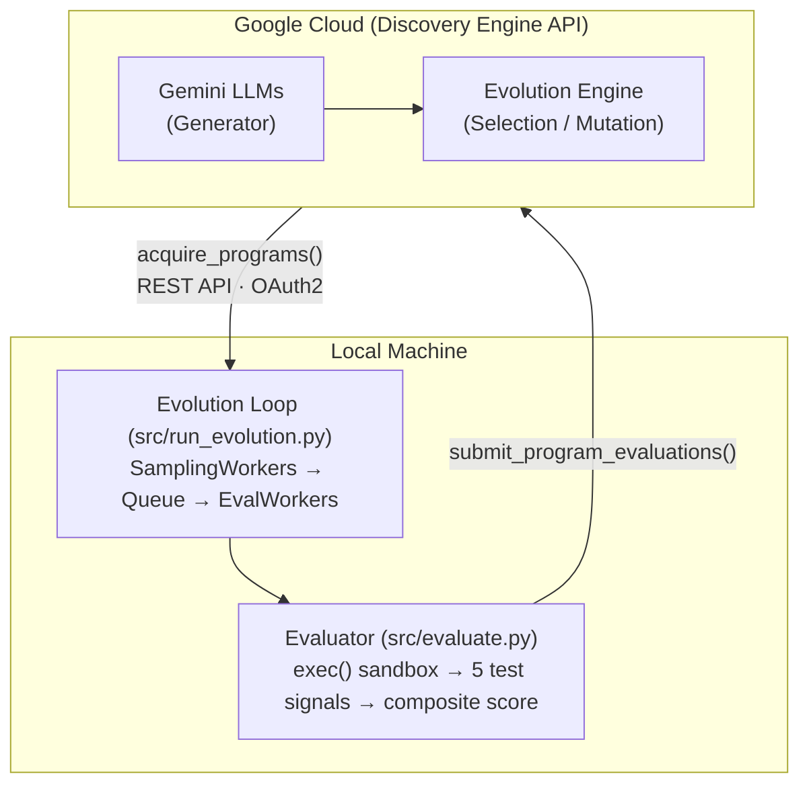

# Adaptive Signal Processing — AlphaEvolve Example

Evolve a signal processing algorithm for non-stationary time series data,
minimizing noise while preserving dynamics. Uses local Python evaluation.

## Overview

- **Problem**: Filter volatile, noisy time series while minimizing spurious
  directional reversals, lag, and phase delay.
- **What gets evolved**: The `adaptive_filter()`,
  `enhanced_filter_with_trend_preservation()`, and `process_signal()` functions
  inside the EVOLVE-BLOCK in `src/program.py`.
- **Baseline**: A weighted moving average with exponential weights emphasizing
  recent samples.

## Architecture



## Metrics

| Metric | Description |
|--------|-------------|
| `overall_score` | **Primary.** Weighted combination of composite, smoothness, accuracy, noise reduction, and reliability. Higher is better. |
| `composite_score` | J(theta) multi-objective optimization function. |
| `correlation` | Pearson correlation with ground truth clean signal. |
| `noise_reduction` | SNR improvement over raw noisy input. |
| `slope_changes` | Directional reversals in filtered signal (lower is better). |
| `success_rate` | Fraction of test signals processed successfully. |

### Multi-objective optimization function

```
J(theta) = 0.3 * S(theta) + 0.2 * L_recent(theta) + 0.2 * L_avg(theta) + 0.3 * R(theta)
```

Where S = slope change penalty, L_recent = instantaneous lag error,
L_avg = average tracking error, R = false reversal penalty.

## Prerequisites

1. Python >= 3.9
2. GCP project with Discovery Engine API enabled
3. `gcloud` CLI installed and authenticated

## Quick Start

### 1. Setup

```bash
make setup    # Install deps (including scipy, pykalman, etc.), create .env
make auth     # Authenticate with GCP
```

Edit `.env` with your `PROJECT_ID` and `GE_APP_ID`.

### 2. Run

```bash
make run      # Start the AlphaEvolve experiment
```

The experiment will:
1. Upload the seed filtering algorithm from `src/program.py`.
2. Run the evolution loop, evaluating against 5 diverse test signals.
3. Print the top 3 evolved programs by overall score.

### 3. Re-evaluate a saved program

```bash
python -m examples.signal_processing.src.eval_prog_file path/to/program.py
```

## Files

| Path | Purpose |
|------|---------|
| `instructions.md` | Problem description and instructions for the LLM |
| `Makefile` | Step-by-step orchestration (`make help` for targets) |
| `example.env` | Configuration template (copy to `.env`) |
| `requirements.txt` | Example-specific dependencies (scipy, pykalman, etc.) |
| `src/program.py` | The filtering algorithm being evolved (`EVOLVE-BLOCK` markers) |
| `src/evaluate.py` | Client-side evaluation function (multi-objective scoring) |
| `src/run_evolution.py` | Entry point: runs the evolution loop |
| `src/eval_prog_file.py` | Offline re-evaluation of saved programs |
