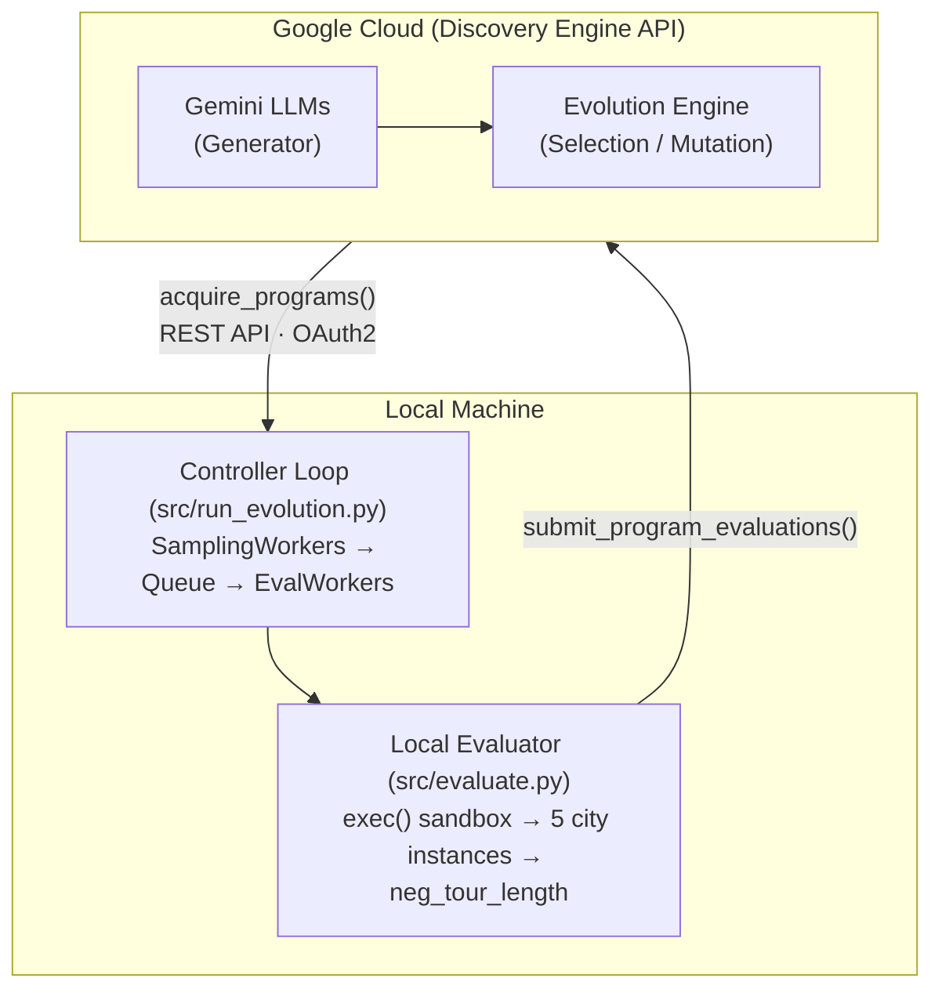

# Travelling Salesman Problem (TSP) — AlphaEvolve Example

Evolve a tour-construction heuristic for the classic Travelling Salesman
Problem using AlphaEvolve with **local Python evaluation**.

## Problem

Given **N = 50** cities with 2D coordinates drawn uniformly from [0, 1] x [0, 1],
find the shortest Hamiltonian cycle (tour) visiting every city exactly once and
returning to the start.

The seed algorithm is a **nearest-neighbor heuristic** starting from city 0.
AlphaEvolve will evolve the `construct_tour(distances, n)` function to discover
better construction and improvement strategies (2-opt, or-opt,
Lin-Kernighan-style moves, simulated annealing, etc.).

## Metrics

| Metric | Description |
|--------|-------------|
| `neg_tour_length` | **Primary.** Negative of the average tour length across 5 test instances (higher is better). |
| `tour_validity` | 1.0 if every tour is a valid permutation, 0.0 otherwise. |
| `avg_improvement_over_random` | Average percentage improvement over random tours. |

## Evaluation

Programs are evaluated **locally** using Python `exec()` in a sandboxed
namespace. Each candidate is tested on 5 fixed random city instances
(seeds: 42, 123, 256, 789, 1024) for reproducibility.

## Prerequisites

1. Python >= 3.9
2. Install the package:

```bash
uv pip install -e ".[dev]"
```

3. Configure your GCP project:

```bash
cp example.env .env
# Edit .env with your PROJECT_ID and GE_APP_ID
gcloud auth application-default login
```

## Quick Start

```bash
make setup       # Install deps, copy .env template
# Edit .env with your PROJECT_ID and GE_APP_ID
make auth        # Authenticate with GCP
make run         # Run the experiment
```

Or directly:

```bash
python -m examples.tsp.src.run_evolution
```

## Files

| File | Purpose |
|------|---------|
| `__init__.py` | Package marker |
| `src/program.py` | Seed algorithm with `EVOLVE-BLOCK` markers |
| `src/evaluate.py` | Local evaluation function (sandboxed exec) |
| `src/run_evolution.py` | Entry point: experiment setup, controller loop |
| `src/utils/visualization.py` | Google-style plotting helpers |
| `src/utils/report.py` | Post-experiment report generation (5 charts + console summary) |
| `Makefile` | Orchestrates `setup` / `auth` / `run` / `clean` |
| `example.env` | Configuration template |
| `README.md` | This file |

## Architecture



## Reference

This example is inspired by the [OpenEvolve TSP tour minimization](https://github.com/algorithmicsuperintelligence/openevolve/tree/main/examples/tsp_tour_minimization)
example, simplified to pure Python with local evaluation for ease of use.
