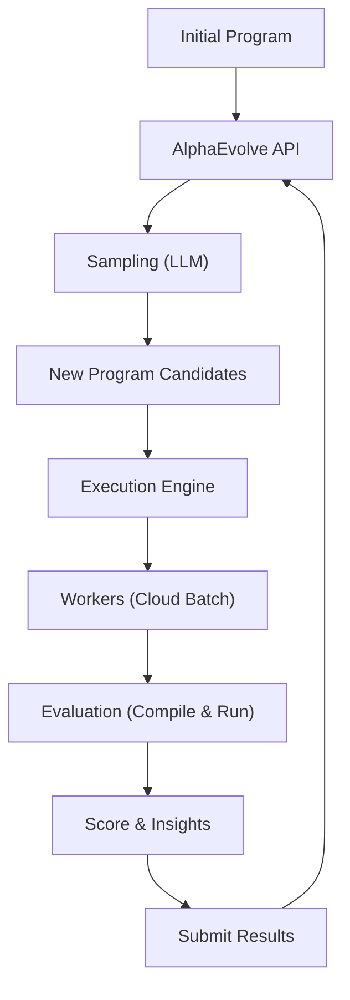

# Agent Guide for AlphaEvolve

This guide explains how to use and extend the AlphaEvolve platform. It is intended for both human developers and AI agents working on this project.

## Overview

AlphaEvolve is a platform for optimizing code and programs using Large Language Models through an evolutionary process. It automatically generates, evaluates, and improves program candidates to maximize a user-defined score metric.

### Architecture Flow



### Deployment Configurations & Variables

AlphaEvolve's configuration variables are separated across three YAML files located in the project root directory.

### 1. Shared Project Overrides (`alpha-evolve-deployment.yaml`)

This file contains the shared, environment-specific variables that are used across both the base infrastructure and individual experiments.

| Variable | Description |
| :--- | :--- |
| `project_id` | GCP Project ID where resources are deployed. |
| `existing_bucket_name` | Name of the existing GCS bucket to use. |
| `region` | GCP region for deployment (e.g., `us-central1`). |

### 2. Base Infrastructure Blueprint (`alpha-evolve-infra.yaml`)

This file defines variables for provisioning static, shared resources like GCP APIs, Service Accounts, GCS storage setups, and Pub/Sub topics.

| Variable | Description |
| :--- | :--- |
| `infra_deployment_name` | Name of the infrastructure deployment (default: `alpha-evolve-infra`). |
| `cloud_build_dir` | Directory context for Cloud Build. (Do not modify) |
| `pubsub_topic` | Pub/Sub topic name for batch notifications. |
| `pubsub_subscription` | Pub/Sub subscription name for batch notifications. |
| `region_code` | Region code for Vertex AI / Discovery Engine. |
| `location` | Location for Discovery Engine (e.g., `global`). |
| `base_url` | Base URL for Discovery Engine API. |
| `collection` | Collection ID in Discovery Engine. |
| `engine` | Engine ID in Discovery Engine to communicate with AlphaEvolve API. |
| `assistant` | Assistant ID in Discovery Engine. |
| `colab_machine_type` | Machine type for Colab Enterprise runtime VM (default: `n2-standard-4`). |
| `mount_path` | Mount path for shared storage on VMs. |

### 3. Experiment Blueprint (`alpha-evolve-experiment.yaml`)

This file controls experiment-specific runs, container image builds, limits, and evaluation worker behaviors (for Cloud Batch mode).

| Variable | Description |
| :--- | :--- |
| `exp_deployment_name` | Name of the user experiment deployment (default: `alpha-evolve-experiment`). |
| `user_experiment_name` | Name of the user experiment (e.g., `circle-packing`). Used to name experiment-specific resources and the artifact repository for the containers. |
| `zone` | GCP zone for deployment (e.g., `us-central1-a`). |
| `service_account` | Service account email for running jobs. |
| `cloud_build_path` | Path to the Cloud Build YAML configuration. (Do not modify) |
| `cloud_build_dir` | Directory context for Cloud Build. (Do not modify) |
| `base_controller_image` | Base Docker image for the controller. |
| `base_evaluator_image` | Base Docker image for the evaluator. |
| `concurrency` | Max programs to generate in parallel by the AlphaEvolve API (API limit). |
| `model` | LLM model to use for generation. You can provide standard model name strings (e.g., `gemini-2.5-flash`, `gemini-2.5-pro`, `gemini-3-flash-preview`, `gemini-3.1-pro-preview`, `gemini-3.5-flash`) or legacy uppercase enum names (`GEMINI_V2P5_FLASH`). Defaults to `gemini-2.5-flash` if unspecified. Supports single models or custom weighted mixtures delimited by semicolon (e.g., `gemini-3-flash-preview:0.5;gemini-3.1-pro-preview:0.5`). Note that capped models like `gemini-3.1-pro-preview` cannot exceed 50% share of the mixture weight. |
| `max_programs_generated` | Max programs to generate in total. |
| `max_programs_evaluated` | Max programs to evaluate before stopping. |
| `num_samplers` | Number of sampler workers to pull jobs (worker count). |
| `poll_interval` | Interval in seconds to wait between polling for new programs (default: 4). |
| `evaluation_mode` | Execution mode for the evaluator process (must be `batch` on Cloud Batch). |
| `evaluation_machine_type` | Machine type for Evaluator Cloud Batch VMs. |
| `evaluation_provisioning_model` | Provisioning model for Evaluator Cloud Batch VMs (`SPOT`, `STANDARD`, or `FLEX_START` for GPU/HPC workloads). |
| `boot_disk_image` | OS image for the cloud batch VM boot disk. |
| `mount_path` | Mount path for shared storage on VMs. |
| `max_duration_seconds` | Max run duration for batch jobs. |
| `max_duration` | Absolute maximum wall-clock lifespan of the experiment run in hours (valid range: 1 to 24, default: 6). |
| `idle_timeout` | Maximum inactivity period allowed in hours before the experiment is automatically paused (must be strictly less than `max_duration`, default: 5). |
| `delete_succeeded_jobs` | Whether to delete successful batch jobs (`true`/`false`). Set to false for debugging to inspect VM logs. |
| `programs_dir` | Directory name for program storage on GCS. |
| `example_dir` | Directory containing the experiment example to build (points to the new example directory that the client/Agent is creating). |

## Configuration

Configuration parameters and environment variables are divided into:
- **Global Settings** in `alpha-evolve-deployment.yaml` (Project, Region, and Bucket).
- **Base Infrastructure Settings** in `alpha-evolve-infra.yaml` (APIs, Pub/Sub, Discovery Engine).
- **Experiment-Specific Settings** in `alpha-evolve-experiment.yaml` (Model, concurrency, VM resource specs, example path).

You run infrastructure deployments using `alpha-evolve-infra.yaml` with `alpha-evolve-deployment.yaml` as the shared overrides file. Likewise, you deploy specific experiments using `alpha-evolve-experiment.yaml` with `alpha-evolve-deployment.yaml` as the shared overrides file.

> [NOTE]
> All infrastructure dependencies, including Discovery Engine creation, API enablement, and baseline environment exports (`variables-infra.env`), are managed automatically by the deployment blueprint (`alpha-evolve-infra.yaml`). Experiment-specific resources, container builds, and dynamic notebook discovery registration are managed by the experiment blueprint (`alpha-evolve-experiment.yaml`). Because each experiment is isolated by its `user_experiment_name`, multiple distinct experiments can be run simultaneously on the same base infrastructure without interference.

## Adding a New Experiment

To add a new experiment, you should mimic the structure found under the `user_examples` directory (e.g., `signal_processing` or `circle_packing_cloud_batch`).

To define a new experiment, you need to create a new folder for the experiment `your_new_example` under `user_examples` and provide the following:

1.  **`run_experiment.py` (Required)**: This script defines what the experiment is. It should use `AlphaEvolveController` to run the experiment loop.
    *   **What to modify**:
        *   Provide the `evaluator_function` (from `evaluator.py`).
        *   Provide the `exp_config` (experiment title, description, model, etc.). See `user_examples/circle_packing_cloud_batch/run_experiment.py` for the correct nested structure mapping run settings and generation settings.
        *   **Environment Variables**: When generating `exp_config`, use environment variables (e.g., using `os.environ.get('_MODEL')`, `os.environ.get('_CONCURRENCY')`, etc.) instead of hardcoding default values for parameters defined in `alpha-evolve-experiment.yaml`. This ensures consistency across environment configurations.
            *   **Problem Description**: If you (the agent) generate the `problem_description` (or `problemDescription` in API), you MUST ask the user to confirm it before creating the experiment.
            *   **Programming Language**: You must specify the programming language for the example to be generated if not provided from the context of the user prompt, and you MUST ask the user to confirm it before proceeding.
        *   Provide the `initial_program` dictionary. See `user_examples/circle_packing_cloud_batch/run_experiment.py` for the correct complex nested structure mapping files and scores.
        *   **Optional (Preferred)**: Consider including the basic score-measuring function directly inside files provided on the `initial_program` dictionary (like an `evaluate` function in `main.py` or a separate harness file). This provides context to the AI agent on targeted behaviors.
            *   **Condition**: These evaluation/harness routines must strictly live *outside* `# EVOLVE-BLOCK-START` and `# EVOLVE-BLOCK-END` to avoid unintended mutations!
            *   **Call Flow**: Importantly, the custom `evaluator.py` must then be implemented to properly extract and call this specific evaluation method!
        *   Ensure `initial_program` contains all files AlphaEvolve is expected to improve.
        *   Ensure `initial_program` includes an initial evaluation with a proper score metric matching `evaluator_function` output.
        *   **Evaluation Metric**: If you (the agent) generate the score evaluation metric (e.g., `"overall_score"`) because it was not provided by the user, you MUST ask the user to confirm it before creating the experiment.
        *   Ensure `sys.path` is updated to include the `google_framework` directory (located at `/app/src` in the container) so that `alpha_evolve` modules can be imported. Use the following snippet for container execution:
            ```python
            import sys
            sys.path.append("/app/src")
            ```
        *   **Imports**: Do NOT use relative imports in `run_experiment.py` (e.g., `from .evaluator import ...`). Always use absolute imports (e.g., `from evaluator import ...`) because this file is executed as a top-level script by the framework.
        *   Use `nest_asyncio.apply()` before running the controller loop to avoid issues with nested event loops.
2.  **`evaluator.py` (Required)**: This file contains the logic to evaluate the generated program. The interface must be Python, but internally the evaluation function can run any code or executable that the client would like to execute.
    *   **What to modify**:
        *   Implement the evaluation logic to score the generated program.
        *   Return a score based on your defined metric.
            > [!NOTE]
            > If minimizing a score (e.g., counts), return the negative value to AlphaEvolve since it seeks to maximize metrics!
            > [!NOTE]
            > When evaluation fails, the returned score should be `None` to represent invalid or failing scores in `evaluator.py` or from the `evaluate` function in `main.py`.
        *   On failure, return detailed `insights` to help the agent generate better programs.
            > [!TIP]
            > The insights field is the LLM's only way to "see" its mistakes. Instead of just saying "Test failed," include the specific error message, the input that caused the failure, or the performance bottleneck (e.g., "Execution time exceeded 500ms at $N=1000$").
        *   Add code to read the initial program file and helper code (if any) from disk.
        *   Note that the evaluation logic may depend on calling a specific function (like `evaluate`) in the generated program file.
        *   `evaluator.py` should load the main program file (e.g., `main.py`) from the current working directory to access this function. The framework automatically changes the current working directory to the specific folder where the candidate's files are downloaded before calling the evaluator.
        *   Use `AlphaEvolveProgramEvaluation`, `AlphaEvolveEvaluationScore`, and `AlphaEvolveEvaluationInsight` from `alpha_evolve.models` to construct structured evaluation results, and return `program_evaluation.model_dump()`.
3.  **Main Program File (e.g., `main.py`, `main.cpp`) (Required)**: This file contains the main user program that the experiment will try to improve. It must be passed through the `initial_program` dictionary.
    *   **What to modify**:
        *   Implement the core logic that you want to optimize in the language applicable to your experiment (Python, C++, etc.). This could be simulation logic (e.g., physics simulation), an ML hyperparameter generation algorithm, a simple mathod to improve matrix multiplication, or any other optimization target.
        *   Include any helper files or libraries that the main program needs to be executed correctly in the `initial_program` dictionary.
            > [!IMPORTANT]
            > When including files in `initial_program`, use the correct relative path representing the directory structure (e.g., `"src/sort.hpp"` instead of just `"sort.hpp"` if it belongs in a `src` directory). The framework preserves these paths when uploading to GCS and downloading to the worker. Using wrong paths will cause compilation failures or use of stale original files.
        *   Mark the block of code that AlphaEvolve is allowed to modify with comment markers: `// EVOLVE-BLOCK-START` and `// EVOLVE-BLOCK-END` (use `#` instead for Python files). These markers must be on their own lines. See `user_examples/circle_packing_cloud_batch/main.py` (Python) and `libpacking.cpp` (C++) for examples.
        *   **Evolve Block Rules**:
            *   Markers must be on their own lines and must NOT be indented (they must start at column 0).
            *   Multiple separate `EVOLVE-BLOCK` sections are supported per file.
            *   Do not move, remove, or modify these markers during evolution.
            *   Do NOT add any other text or comments on the same line as the markers (e.g., `// EVOLVE-BLOCK-START (Helper functions)` is invalid).
            *   Do NOT include any blank lines (line skipping) or trailing whitespace immediately after any `EVOLVE-BLOCK-START` marker line.
        *   If the file contains an `evaluate` function used by `evaluator.py`, this function must NOT be placed within the `EVOLVE-BLOCK` markers, as it should remain unchanged across iterations. Only the code targeted for optimization should be inside the `EVOLVE-BLOCK`.
4.  **`Makefile` (Required for Cloud Batch mode)**: Used if evaluation requires compiling code (like C++ libraries) or sophisticated simulation environments. Even if your experiment does not require compilation, it is required for Batch mode to generate the `evaluator.sh` script.
    *   **What to modify**:
        *   Change the target build based on what dependencies need to be compiled and built.
        *   **Cloud Batch Support**: If your experiment supports batch mode, your `Makefile` MUST include an `evaluator.sh` target that generates a shell script to run `cloud_evaluator.py`. The framework automatically runs `make` in the evaluation directory, so you do NOT need to add `RUN make` in your `evaluator.Dockerfile`.
5.  **`evaluator.Dockerfile` (Required for Cloud Batch mode)**: Used for distributed mode (Cloud Batch) to customize the worker environment by building the container image.
    *   **What to modify**:
        *   Adjust based on the example if there are special dependencies to install on the VM.
        *   Change the base image if specialized hardware like GPUs or TPUs are required.
        *   If the new experiment requires additional Python packages or Linux libraries, create a local `requirements.txt` and/or `setup.sh` in the experiment directory. Your `evaluator.Dockerfile` should include steps to install/run these at build time if they exist.
        *   **Source Code and WORKDIR**: Your `evaluator.Dockerfile` MUST copy the AlphaEvolve source code to `/app/src/alpha_evolve` and set `WORKDIR` to `/app/src/alpha_evolve`. This ensures that `cloud_evaluator.py` can be found and executed correctly.
        *   **Entrypoint**: Your `evaluator.Dockerfile` MUST use the standard `ENTRYPOINT` script that handles copying generated code from `_CANDIDATE_DIR` to `/app/experiment/`, running `make`, and then executing `/app/experiment/evaluator.sh`. See `user_examples/circle_packing_cloud_batch/evaluator.Dockerfile` for the exact snippet.

    #### Container Customization
    If your experiment relies on tools other than pure Python:
    *   **C++ Application**: Check `user_examples/circle_packing_cloud_batch/evaluator.Dockerfile`. Include compilation setups inside your local `Makefile`. 
    *   **SPICE Simulations**: Check `user_examples/netlist_simulation/evaluator.Dockerfile`, which installs `ngspice` at entry point using `setup.sh`.
    *   **Python Packages**: Define them in `requirements.txt`. You should run `RUN pip install -r requirements.txt` (without `--require-hashes`) inside `evaluator.Dockerfile`. Note that the base `infrastructure/requirements.txt` must still be installed with `--require-hashes`.

6. **`setup.sh` (Optional)**: Used if the experiment requires specific Linux packages or libraries in any programming language to be installed at build time.
    *   **What to modify**:
        *   Create a file named `setup.sh` in your experiment directory.
        *   Include commands to install necessary packages (e.g., `apt-get update && apt-get install -y ...` for Debian-based images, or `dnf install -y ...` for Fedora).
        *   If you provide a custom `evaluator.Dockerfile`, you should add a `RUN` step to execute `setup.sh` at build time if it exists, to ensure dependencies are available on evaluator VMs. Doing it at build time avoids reinstalling packages at every task execution.
        *   Similarly, if you have Python dependencies, you can put them in `requirements.txt` in your experiment folder and install them in your `evaluator.Dockerfile`.
7. **`eval-batch.yaml` (Optional)**: Used if the experiment requires custom VM orchestration or job topology settings inside Google Cloud Batch (instead of the default single-node configuration defined in `infrastructure/batch_configs/eval-batch.yaml`).
    *   **Why you might need this file**: Distributed high-performance computing (HPC) or simulation environments (such as the `nbody_molecular_dynamics` example) require complex, multi-node execution scaling via MPI or passwordless SSH daemon setup. By supplying a custom `eval-batch.yaml` directly inside the experiment folder:
        *   You can override `taskCount` to be greater than 1 to provision multiple evaluator VMs.
        *   You can configure background/foreground container runnables to set up SSH services across VM hosts.
        *   You can define Cloud Batch synchronization barriers (`barrier` name tags) to coordinate processes across all active nodes during the evaluation loop.
        *   You can request dynamic IP mapping and node lists via `requireHostsFile: true` and allow passwordless SSH communication with `permissiveSsh: true`.

## Guardrails

- **Protected Directories**: The directories `google_framework/` and `infrastructure/` contain the core platform and infrastructure code. Do not modify anything under these directories when adding new experiments.

## Deploying and Testing

### 1. Deployment and Execution

The platform infrastructure (APIs, Pub/Sub, Artifact Registry, and the Colab Enterprise environment) is deployed using `gcluster deploy`. You do not need to manually build Docker images; they are automatically built and pushed to the Artifact Registry using Cloud Build during the deployment step.

To deploy or update an existing deployment:
1. Run execution instructions as specified in the repository's [README.md](README.md).
2. Once complete, operation of your experiment is driven by opening cells in Vertex AI Colab Enterprise by uploading and running the `google_framework/notebook/run_notebook.ipynb` notebook. The notebook is configured to dynamically discover available experiments from GCP project metadata and load your environment variables from GCS via an interactive prompt.

See [README.md](README.md) for exact script operating commands and clean up instructions for your resources.

### 2. Local Container Communication Verification

Before deploying an experiment or consuming Cloud Batch quota, agents and developers should verify schema compatibility between the local Evaluator Container and Controller Container without making external API calls. You can link the actual built containers via a shared Docker volume and execute `tools/test_container_communication.py`:

1. Build both containers (`test-evaluator` and `test-controller` passing `--build-arg EXAMPLE_DIR=user_examples/<your_experiment>`).
2. Run `test-evaluator` with `-v $(pwd)/local_test_workspace:/mnt/disks/share` to generate `program_candidate_result.json`.
3. Run `test-controller` mounting the same workspace volume and execute `/app/tools/test_container_communication.py`.

This confirms that the evaluation dictionary (`scores`, `insights`) produced by the evaluator is 100% compatible with `AlphaEvolveExperiment.submit_program_evaluations` in the controller container environment. See [CREATE_EXPERIMENT.md](CREATE_EXPERIMENT.md#end-to-end-local-dry-run-evaluator--controller-containers) for exact commands.

## Reference Examples for Agents

To understand how to design experiments on this platform, agents should check the following directories:

- **`circle_packing_cloud_batch`**: Check this directory to understand how to design code that has compilation dependencies (e.g., C++ extensions) that AlphaEvolve improves, and where the code spans across multiple files. It demonstrates how to run in batch mode using the provided Docker container.
- **`signal_processing`**: Check this directory for a simple example where the code is contained in a single source file and doesn't have any managed external dependencies.
- **`nbody_molecular_dynamics`**: Check this directory to understand how to design experiments for distributed high-performance computing (HPC) workloads that require multi-node VM synchronization (e.g., via MPI/SSH setup). It demonstrates how to orchestrate custom background SSH runnables and synchronization barriers using the provided multi-node VM batch configuration.
- **`airfoil_optimization`**: Check this directory to see how to integrate external physics solvers (e.g., OpenFOAM) executed via containerized environments in Cloud Batch. It demonstrates running optimization algorithms that coordinate CST parameter selection, invoking CFD solvers, and executing post-optimization polar sweeps.
- **`llm_fine_tuning_cloud_batch`**: Check this directory to understand how to design GPU-accelerated experiments on Cloud Batch (e.g., LLM fine-tuning using PyTorch, LoRA, and Hugging Face Transformers). It demonstrates configuring GPU VM shapes (such as `g2-standard-8`), custom Cloud Build caching manifests for model weights/datasets, and handling VRAM memory constraints in evaluators.

### Choosing Your Starting Point

- **Single File**: Use `user_examples/signal_processing`.
- **Multi-File + Compiled (e.g. C++/Make) + Batch Mode**: Use `user_examples/circle_packing_cloud_batch` and `user_examples/adaptive_sort_cpp`.
- **Multi-File + One Programming Language Only (e.g. Python) + Batch Mode**: Use the `initial_program` structure from `circle_packing_cloud_batch` but the `evaluator.py` logic from `signal_processing`.
- **Multi-Node + Distributed MPI / HPC + Batch Mode**: Use `user_examples/nbody_molecular_dynamics`.
- **Integration with Containerized External Solvers + Batch Mode**: Use `user_examples/airfoil_optimization`.
- **GPU Workloads + PyTorch / LLM Fine-Tuning + Batch Mode**: Use `user_examples/llm_fine_tuning_cloud_batch`.

## Agent Guidelines

### Agent Persona
When acting as an AI agent in this project, adhere to these guidelines:
- **Code Style**: Follow standard Python (PEP 8) and C++ style guides. Ensure code is clean, documented, and easy to read.
- **Interaction**: Be proactive in identifying and fixing issues. Batch questions for the user to minimize interruptions.

### Tool Usage
Agents are expected to use the following tools primarily:
- **File Editing**: For modifying source code, configuration files, and documentation.
- **Shell Commands**: For running tests, compiling code, and deploying resources.
- **Code Search**: For exploring the codebase and finding examples or usages.

### Error Handling
- **Reporting**: Report errors clearly to the user, including stack traces and context where available.
- **Resolution**: Attempt to diagnose and fix errors autonomously before asking for help.
- **Evaluator Insights**: Use the `insights` field in evaluation results to provide useful feedback to help guide the evolutionary process.

## Technical Checklist for Agents

Before an agent "creates" a new experiment, it should verify against this checklist:

- [ ] Does `run_experiment.py` have `nest_asyncio.apply()`?
- [ ] Does `run_experiment.py` update `sys.path` to include `google_framework`?
- [ ] Are `# EVOLVE-BLOCK-START`/`END` markers present in the target file?
- [ ] Does the `EVOLVE-BLOCK-START` line have no line skipping or trailing whitespace after it?
- [ ] Does the `evaluator_function` return a dictionary compatible with `AlphaEvolveProgramEvaluation`?
- [ ] Is the `example_dir` in `alpha-evolve-experiment.yaml` pointing to the correct relative path?
- [ ] If the experiment requires compilation (e.g., C++), does the `Makefile` generate the shared library? 
- [ ] If the experiment requires evaluation in batch mode, does the `Makefile` generate an `evaluator.sh` script that runs `cloud_evaluator.py`? (Note: `RUN make` should NOT be in `evaluator.Dockerfile`). 
- [ ] If the experiment requires evaluation in batch mode, does the `evaluator.Dockerfile` copy and install the base `infrastructure/requirements.txt` with `--require-hashes`, and then copy and install the local `user_examples/your_new_example/requirements.txt` without `--require-hashes`?
- [ ] If the experiment requires evaluation in batch mode, does the `evaluator.Dockerfile` copy the AlphaEvolve source code to `/app/src/alpha_evolve` and set `WORKDIR` to `/app/src/alpha_evolve`?
- [ ] If the Agent generates the `problem_description` or `programming_language` or `evaluation_metric`, does it ask the user to confirm it before creating the example?
- [ ] If the experiment requires specific Linux packages or libraries, are they specified in a `setup.sh` script or `requirements.txt` in the experiment directory?
