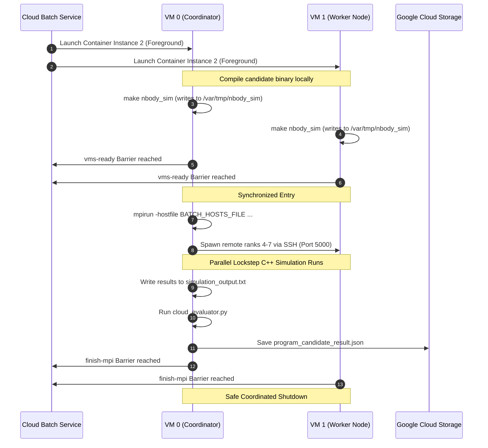

# 🌟 Parallel N-Body Molecular Dynamics on Google Cloud Batch

Welcome to the parallel N-Body Molecular Dynamics example for AlphaEvolve. This directory contains a highly scalable, distributed simulation of gravitational particle interactions optimized by the AlphaEvolve AI model using High-Performance Computing (HPC) and Message Passing Interface (MPI) techniques on Google Cloud Batch.

---

## 📖 Part 1: General Overview (For Everyone)

### What is an N-Body Simulation?
Imagine a galaxy filled with thousands of stars. To simulate how this galaxy moves over time, we must calculate the gravitational pull between **every single star** and **every other star**. 
* If we have 10 stars, we perform $10 \times 10 = 100$ calculations.
* If we have 1,000 stars, we perform $1,000 \times 1,000 = 1,000,000$ calculations!
* In computer science, this is known as an **$O(N^2)$ problem**, and it grows extremely slow very quickly. This is the fundamental math behind molecular dynamics, astrophysics, and particle physics.

### How AlphaEvolve Optimizes the Simulation
**AlphaEvolve** is an evolutionary AI system that optimizes code. It automatically writes, compiles, and evaluates thousands of highly advanced variations (candidates) of C++ code to find the fastest possible way to calculate these forces. 

To get the absolute best performance, the AI attempts to use advanced optimizations like **AVX/SIMD Vectorization** (calculating multiple mathematical equations at the exact same CPU cycle) and **Parallel Processing**.

### The Power of Cloud Batch & MPI
To evaluate these candidates at scale, AlphaEvolve launches them on a **Google Cloud Batch cluster** consisting of multiple virtual supercomputers (Virtual Machines or VMs) working together in lockstep:
* **MPI (Message Passing Interface)**: This is a protocol that allows multiple computers to act as a single virtual team. Instead of one computer doing all $1,000,000$ calculations, MPI allows us to split the stars across all the VMs in the cluster, calculating gravitational forces in parallel.
* **Google Cloud Batch**: Automatically provisions the virtual machines, configures network communications, and shuts down the resources the second the evaluation is finished so you only pay for the exact seconds of computation used.

---

## 🛠️ Part 2: Technical Setup & Architecture (For Developers)

### The Parallel Execution Lifecycle


### Multi-Container Filesystem Bridge
Google Cloud Batch runs the background SSH daemon (used by MPI to connect nodes) in **Container 1**, and runs the compilation/evaluation script in **Container 2**. 

Because these containers are filesystem-isolated, compiling the binary in Container 2 leaves Container 1's SSH connection unable to locate the executable on worker nodes. 

To bridge this filesystem gap:
1. We map a standard pre-existing local VM host directory `/var/tmp` into both Container 1 and Container 2: `- /var/tmp:/var/tmp`.
2. The **[Makefile](Makefile)** compiles the binary locally and copies it directly into this shared host mount path:
   ```make
   nbody_sim: main.cpp
       $(CXX) $(CXXFLAGS) main.cpp -o nbody_sim
       cp nbody_sim /var/tmp/nbody_sim || true
   ```
3. `mpirun` invokes `/var/tmp/nbody_sim`. Since the path is mounted inside both containers, workers can immediately execute the compiled binary.

---

## 📊 Part 3: HPC & MPI Expert Appendix

### Mathematical & Computational Formulation
The force calculation loop is formulated using a classic softened gravitational calculation:

$$F_{ij} = \frac{G \cdot m_i \cdot m_j}{r_{ij}^2 + \epsilon^2}$$

where $\epsilon$ is a small softening factor ($10^{-9}$) to avoid division-by-zero singularities. Ranks divide the computational matrix into equal horizontal slices based on particle indices:

```cpp
int chunk_size = n / num_ranks;
int start_idx = rank * chunk_size;
int end_idx = (rank == num_ranks - 1) ? n : start_idx + chunk_size;
```

Force aggregation is fully synchronized at the end of each step using low-latency collective MPI all-reduces:
```cpp
MPI_Allreduce(MPI_IN_PLACE, local_fx.data(), n, MPI_DOUBLE, MPI_SUM, MPI_COMM_WORLD);
```

### High-Precision Parallel Benchmarking
To ensure absolute timing precision and eliminate operating system scheduling jitter, we wrap the timed simulation loop with **explicit global MPI Barriers**:

```cpp
// Synchronize entry across all ranks
MPI_Barrier(MPI_COMM_WORLD);
auto start = std::chrono::high_resolution_clock::now();

for (int step = 0; step < steps; ++step) {
    compute_forces_mpi(particles, rank, num_ranks);
    ...
}

// Synchronize exit to measure the slowest rank (tail latency)
MPI_Barrier(MPI_COMM_WORLD);
auto end = std::chrono::high_resolution_clock::now();
```

### MPI OpenSSH & UTS Namespace Configuration
Because Cloud Batch VMs might listen to standard port 22 for administrative tasks, the OpenSSH daemon inside the evaluation containers is dynamically initialized on Port `5000` via [run-ssh.sh](run-ssh.sh):

```bash
echo "Port 5000" >> /etc/ssh/sshd_config
echo "Port 5000" >> /etc/ssh/ssh_config
/usr/sbin/sshd
```

OpenMPI automatically routes remote spawns over Port 5000 through the hosts listed in `$BATCH_HOSTS_FILE`. 

To ensure that TCP packets are routed correctly between nodes without confusing the OpenMPI runtime environment (preventing `received unexpected process identifier` errors), we configure the containers to share the host VM's network and hostname namespaces using the Docker options:
```yaml
options: "--network host --uts=host"
```

### Evaluation Pipeline Integration
The evaluator uses a dual-mode parser in **[evaluator.py](evaluator.py)**:
* **Batch Mode**: Checks for the presence of the cluster-wide output `/app/experiment/simulation_output.txt`, parses execution metrics, applies physics conservation safeguards (verifies that energy drift $\Delta E < 10^{-4}$), and returns the score.
